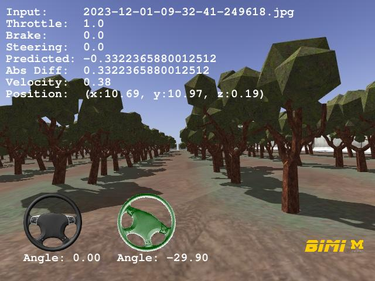
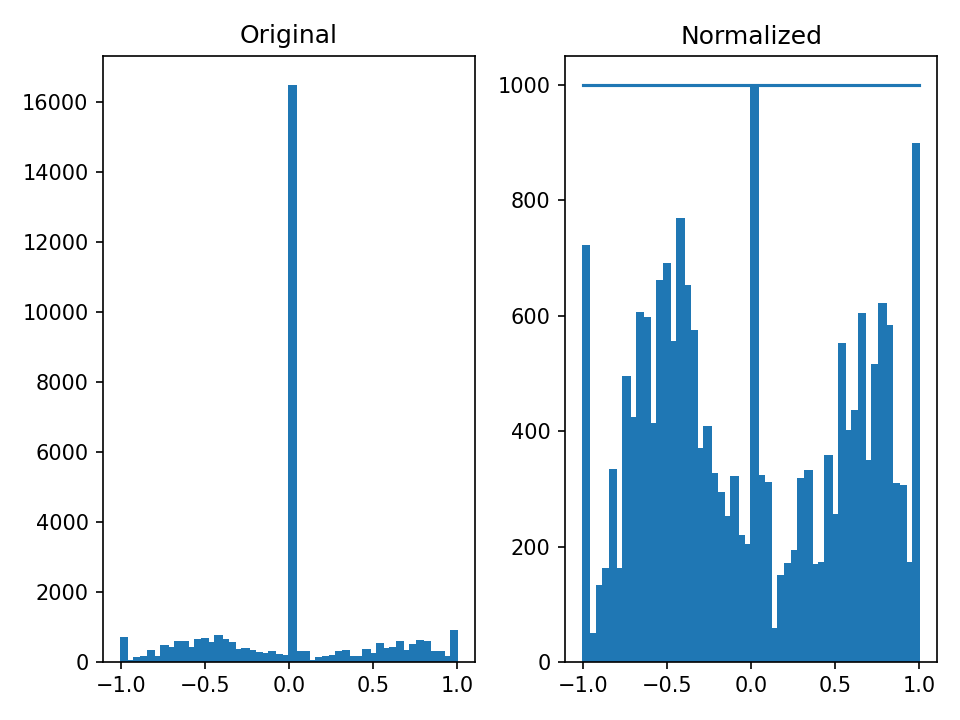
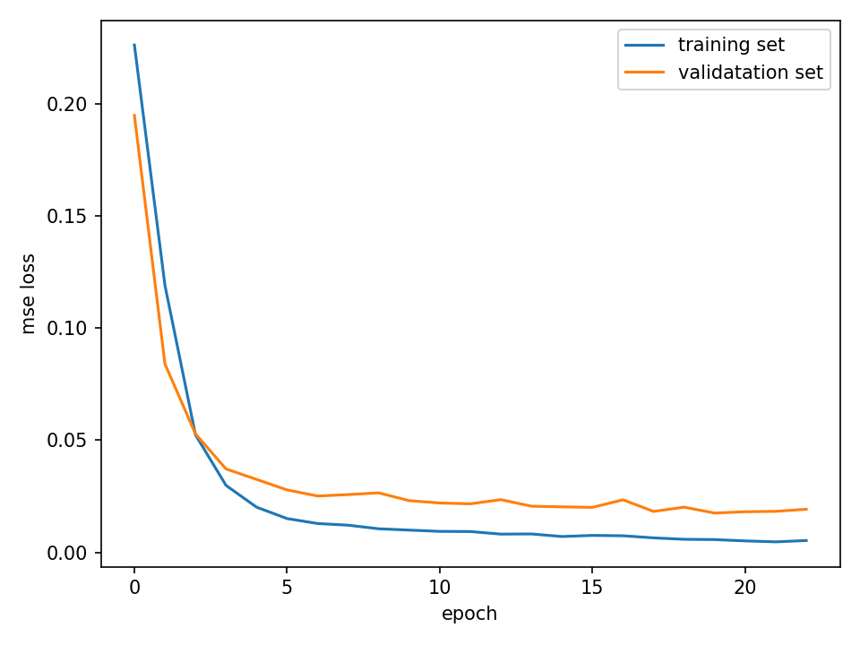
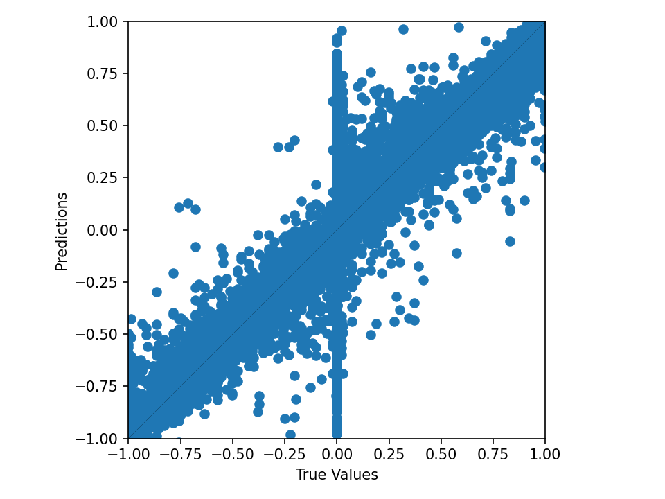

# AgriBot: Intelligent Agricultural Robot 
[](https://youtu.be/FeGPh5DjoWg)
[](https://youtu.be/wanTtd75vcQ)
## To Do

* Check if `scan` or `realsense/scan` for a real robot and simulated?

## History

* 01/02/2024: Remove `fake_localization` and the `gen_pose` option.
* 12/02/2023: Fix data normalization algorithm.
* 12/01/2023: Add `checkpoint` saving option. The default is `False`.
* 11/22/2023: Add `gen_pose` option for `fake_localization`.
* 11/22/2023: Add `p3d` and `fake_localization` for pose data.
* 11/20/2023: Merge the `noetic-devel` branch to `master`.
* 11/20/2023: Add `scout_control_translator`.
* 11/19/2023: Add `joystick_translator`.
* 11/16/2023: Start Noetic version.
* 11/14/2023: Add several How-To's.
* 11/14/2023: Add `view_drive.py` avoiding a direct use of `drive_view.py`.
* 11/12/2023: Add `test_drive.py` replacing a direct use of `drive_log.py`.
* 11/11/2023: Test in the latest TensorFlow.
* 11/11/2023: Change model format to Keras.
* 11/11/2023: Clean up.
* 10/31/2023: Start with submodules.

## Example Results

The following is a `yaml` file example for neural network training.
```
###############################################################################
# This is a jaerock's configuration for scout

# file name: <robot-name>-<person-name-who-trained-network>
# example: if jaerock trained network with data using the robot, scout
#          the file name must be scout-jaerock.yaml

version: 1.00

# history
# 1.00 - start

######################################################
## neural network 

# network definition
network_type: 3        # refer to neural_net/const.py
lstm: False

lstm_timestep: 20
lstm_lr: 0.00001        # 
cnn_lr:  0.001          # default of Adam is 0.001 

# normalize data
normalize_data: True
num_bins: 50
samples_per_bin: 1000

# training 
data_shuffle: True
validation_rate: 0.3
num_epochs: 100
batch_size: 32
num_inputs: 1     # input: image, velocity
num_outputs: 1    # output: steering_angle, throttle
early_stopping_patience: 3
checkpoint: False
# tensorboard log dir
tensorboard_log_dir: logs/scalars/

# data augmentation
data_aug_flip: True
data_aug_bright: True
data_aug_shift: False

# input image size to the neural network
input_image_width:  160
input_image_height: 160
input_image_depth:  3

# steering data preprocessing
# - steering angle adjustment
steering_angle_scale: 1.0
# - steering wheel jitter tolerance
steering_angle_jitter_tolerance: 0.01

```
With the `scout-jaerock-orchard_samples1000.yaml` configuration, the training result is as follows.


The total number of bins is 50 and the maximum samples per bin is 1000 for training data normalization.


The MSE loss curves are nicely smooth. The `EarlyStopping` callback was used.


The prediction performance around zeo steering angle is overall good. But, it is not particularly good around zero steering. This might be able to be improved by adding more training data, where the robot is moving forward in the center of the orchard path.

## How to Clone 

This repo has submodules. Please clone with the following command.

```bash
git clone --recurse-submodules https://github.com/jrkwon/agribot
```

## TensorFlow Installation with CUDA, cuDNN in Anaconda Env
* https://jrkwon.com/2023/11/11/install-tensorflow-with-cuda-cudnn-in-anaconda-environment/


## Additional SDKs

To run `agribot`, you must install SDKs for sensors and additional packages, including `YDLIDAR SDK` and `Cartographer`. The details can be found https://github.com/jrkwon/agribot_ros.

## Prior to Use

Create the `agribot` conda environment. 

**Note:**
We tested `rospy.init_node()` of `ROS Noetic` with `Python 3.11`. Well... `init_node()` never returns. We tried `Pytnon 3.10` that works well with `rospy.init_node()`. Thus, this conda environment has `Python 3.10`.

```
conda env create --file config/conda/environment.yaml
```

## How to Use

```bash
./start_simul.sh launch_filename(without .launch)
```

The name should be without the `.launch` file extension. 

If `scout_orchard_world` is the launch file name (without the .launch extension)that you would like to use, do this.
```bash
./start_simul.sh scout_orchard_world 
```

Then, open another terminal. 
Activate the `agribot` environment.
```bash
conda activate agribot
```

Then `source` the `setup.bash`. You must be at the `agribot` directory when you do this.
```bash
source setup.bash
```

## How to set configuration files

In the `config` directory, there are `config-<name>.yaml` files. You can choose which `yaml` should be used by changing the name `CONFIG_FILENAME` in `neural_net/const.py`


## How to Collect Data

The default data location is `agribot/e2e-dataset/<data-id>`. If `jaerock` collected a data at 5:50:10 PM, Nov 12, 2023, then the directory name of the dataset is `agribot/e2e-dataset/jaerock/2023-11-12-17-50-10`.

```bash
cd path/to/agribot
source setup.bash

rosrun data_collection data_collection.py <data-id> 
```

If you have a separate storage to save data, you can set the `path_to_e2e_data`, which is a `rosparm`. 

```bash
cd path/to/agribot
source setup.bash

rosparam set path_to_e2e_data path/to/location/to/save  
rosrun data_collection data_collection.py <data-id> 
```

The data directory has a lot of images in most cases. So, it can be slow when you open the directory. Users need to open a `CSV` file inside the directory in many cases. Here is a script that can make a symblic link to the `agribot/e2e-dataset/<data-id>`.

```bash
cd path/to/agribot

sh make_simlink.sh path/to/data-dir
```


## How to Train

Note:
- All checkpoint files are now saved at the `yy-mm-dd-hh-mm-ss_ckpt` directory in `agribot/e2e-dataset/<data-id>`
- The trained model is saved as the latest Keras model.
- All pictures and csv files (comprison, err_hist, log, scatter) are generated with the format: `<dataset-dir-name>_<config_name>_<trained-model-name>_<timestamp>` to identify when the training/driving was done with which dataset, which configuration, and which model.
- When neural_net related scripts are run, you are expected at the `agribot` directory.

Here is an example:
```bash
conda activate agribot
cd path/to/agribot

source setup.bash
python neural_net/train.py e2e-dataset/<id>/yyy-mm-dd-hh-mm-ss
```

## How to Do Test Drive

Once you have a trained model, you can do a test drive with a dataset.

Let us assume followings as an example.
- data id: `jaerock`
- dataset name: `2023-10-31-14-56-16`
- config name: `scout-jaerock-orchard--aug`
- network id: `3` 
- timestamp: `2023-11-12-16-25-31-079`

Then, a trained model name is 
`2023-10-31-14-56-16_scout-jaerock-orchard--aug_n3_2023-11-12-16-25-31-079.keras`

Let us test the model with a dataset. You may test the trained network with your training dataset for an initial trial. Then, you may test it with a test data set.

```bash
conda activate agribot
cd path/to/agribot

source setup.bash
python neural_net/test_drive.py path/to/model path/to/data-dir
```

## How to Test Single Prediction

```bash
conda activate agribot
cd path/to/agribot

source setup.bash
python neural_net/test_run.py path/to/model path/to/image
```

## How to Visualize Heatmap

```bash
conda activate agribot
cd path/to/agribot

source setup.bash
python neural_net/visualize_heatmap.py path/to/model path/to/image
```

## How to Generate Images and Movie Showing Control Signals

- Generate images showing control signals.
    ```bash
    conda activate agribot
    cd path/to/agribot

    source setup.bash
    python neural_net/view_drive.py path/to/model path/to/data-dir path/to/target-dir
    ```
    The images will be generated under `path/to/target-dir/data-dir-name`

- Generate mp4 using the generated images.
    ```bash
    cd path/to/agribot

    sh make_video.sh path/to/images/data-dir-name
    ```
    Caution: Do not include `'/'` at the last of the directory name.

## How to Let the Trained Neural Network Drive the Robot

The best practice is to 
- Start a Gazebo simulated world without any conda environment activated.

    ```bash
    cd path/to/agribot
    source setup.bash

    ./start_simul.sh <launch name without '.launch'>
    ```
- Open a new terminal.
- Activate the `agribot` conda environment
    ```bash
    conda activate agribot
    ```
- Start `run_neural`.
    ```bash
    rosrun run_neural run_neural.py path/to/trained/model
    ```

## Troubleshooting

- On Ubuntu 20.04, `cv_bridge` may generate this error below.

    ```bash
    Traceback (most recent call last):
    File "/opt/ros/noetic/lib/python3/dist-packages/rospy/topics.py", line 750, in _invoke_callback
        cb(msg)
    File "/home/jaerock/projects/agribot/catkin_ws/src/run_neural/scripts/run_neural.py", line 67, in _controller_cb
        img = self.ic.imgmsg_to_opencv(image)
    File "/home/jaerock/projects/agribot/neural_net/image_converter.py", line 29, in imgmsg_to_opencv
        cv_img = self.bridge.imgmsg_to_cv2(img_msg, 'rgb8')
    File "/opt/ros/noetic/lib/python3/dist-packages/cv_bridge/core.py", line 163, in imgmsg_to_cv2
        dtype, n_channels = self.encoding_to_dtype_with_channels(img_msg.encoding)
    File "/opt/ros/noetic/lib/python3/dist-packages/cv_bridge/core.py", line 99, in encoding_to_dtype_with_channels
        return self.cvtype2_to_dtype_with_channels(self.encoding_to_cvtype2(encoding))
    File "/opt/ros/noetic/lib/python3/dist-packages/cv_bridge/core.py", line 91, in encoding_to_cvtype2
        from cv_bridge.boost.cv_bridge_boost import getCvType
    ImportError: /lib/x86_64-linux-gnu/libp11-kit.so.0: undefined symbol: ffi_type_pointer, version LIBFFI_BASE_7.0
    ```
- This is because `cv_bridge` is dynamically linked with `libffi.8` not `libffi.7`. Remove that library.
    ```bash
    rm ${CONDA_PREFIX}/lib/libffi.7.so ${CONDA_PREFIX}/lib/libffi.so.7
    ```

## Acknowledgments

### System Design and Implementation
- Jaerock Kwon, PhD, Assistant Professor, Electrical and Computer Engineering, University of Michigan-Dearborn

### Implementation and Contributors
- Elahe Delavari, PhD student, Electrical and Computer Engineering, University of Michigan-Dearborn
- Feeza Khanzada, PhD student, Electrical and Computer Engineering, University of Michigan-Dearborn
